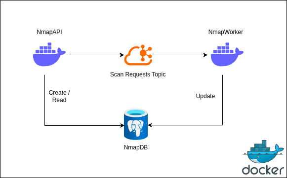
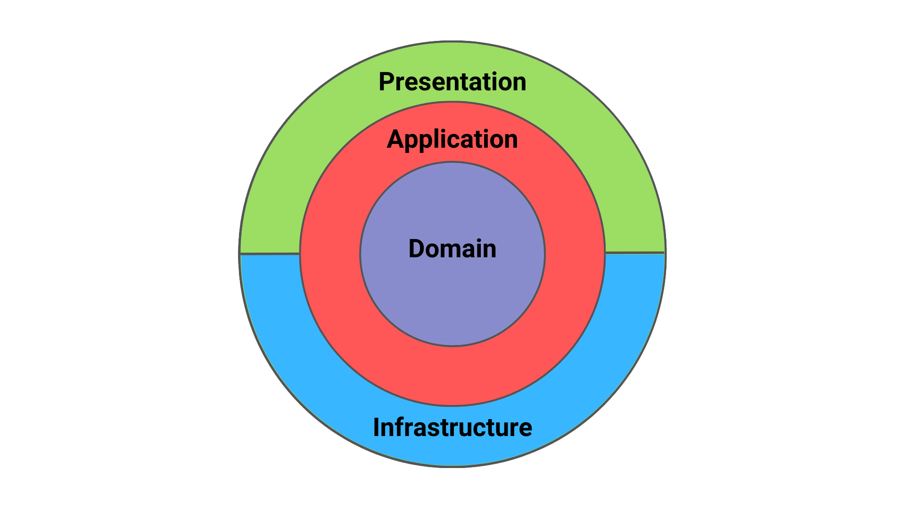

# Netowrk Mapper

## Introduction

This project is a distributed .NET application composed of two services: a REST API and a background worker.  
The API communicates asynchronously with the worker through Kafka, while both services share the same SQL database.  
The full development environment is containerized with Docker Compose for easy setup and local execution.  
This setup makes it simple to run, test, and extend the application in a consistent way.

## Approach

The application is designed around separation of responsibilities.  
The REST API handles client requests and publishes messages to Kafka, while the worker consumes those messages and performs background processing.  
Both services use the same SQL database to persist and access application data.  
Docker Compose is used to orchestrate all required services, including the API, worker, database, and Kafka broker.

## Installation

### Prerequisites

Before running the project, make sure you have the following installed:

- [Docker](https://www.docker.com/)
- Docker Compose

You can verify the installation with:

```bash
docker --version
docker compose version
```

## Functionalities

The REST API is responsible for receiving scan requests, exposing scan data, and providing comparison capabilities between scan executions.  
It stores scan requests in the database, publishes them to Kafka for asynchronous processing by the worker, and exposes endpoints to retrieve and compare scan results.  
For security, the API uses **Auth0-based authorization** to protect access to its endpoints.

### Available Endpoints

- **POST `/scans`**  
  Creates a new scan request.  
  The request is stored in the database and published to Kafka so that the worker can process it asynchronously.  
  This endpoint supports **idempotency** through the `X-Idempotency-Key` header to prevent duplicate scan creation.  
  Before the scan is created, the target is validated to ensure it is a valid **IPv4 address, IPv6 address, or hostname**.

- **GET `/scans/{id}`**  
  Retrieves a scan by its identifier.  
  The response includes the scan details together with the **aggregated scan results**.

- **GET `/scans`**  
  Returns a **paginated list of scans** based on the provided query options.  
  Each returned item includes the related **aggregated scan results**.  
  Output caching is applied to improve read performance.

- **GET `/scans/diff/{target}`**  
  Compares scan results for a given target.  
  The comparison behavior depends on the provided query parameters:
    - when **`from` and `to`** are provided, the diff is computed between those two scans
    - when only **`from`** is provided, the diff is computed between that scan and the latest available scan
    - when neither **`from` nor `to`** is provided, the diff is computed between the latest two scans

  Before performing the comparison, the API validates that:
    - the referenced scans belong to the provided target
    - the scans are in a **completed** state
    - the selected scans respect the correct chronological ordering

### Additional Notes
- **Authorization** is handled with **Auth0** to secure access to the API endpoints.
- **Asynchronous processing** is handled through Kafka, allowing the API to accept requests quickly while the worker performs the scan processing in the background.
- **Pagination** is supported for scan listing to improve performance and usability.
- **Caching** is used for the scans listing endpoint, and the cache is invalidated when a new scan is created.
- **Aggregated results** are returned by the read endpoints to provide a complete view of each scan.

## High Level Design

The solution is composed of two .NET services: a REST API and a background worker.  
The API receives scan requests, stores them in the database, and publishes them to Kafka, while the worker consumes those messages and performs the required background processing.  
Both services share the same SQL database, and Docker Compose is used to orchestrate the full environment locally.
### System Overview

<p align="center">
  
</p>

### Clean Architecture

Both the API and the worker are implemented using Clean Architecture.  
This structure separates the core business logic from infrastructure and framework concerns, making the application easier to maintain, test, and extend.  
The `Domain` layer contains the business entities, the `Application` layer contains the use cases, the `Presentation` layer exposes the API endpoints or worker entry points, and the `Infrastructure` layer handles external dependencies such as the database and Kafka.

<p align="center">
  
</p>

## Other Patterns Used

- **Transactional Outbox Pattern**  
  The API uses the transactional outbox pattern to guarantee consistency between the database state and the Kafka messages published to the worker.  
  Instead of writing to the database and Kafka as two separate operations, the application stores both the business data and an outbox record in the same database transaction.  
  A separate publishing step then reads the pending outbox records and delivers them to Kafka. This avoids the **dual-write problem**, where one operation succeeds and the other fails, leaving the system in an inconsistent state.

  In this project, the pattern ensures that when a scan request is created, the scan is persisted reliably and the corresponding event is eventually published to Kafka for worker processing.

- **Atomic Claim Pattern**  
  The solution also uses an atomic claim pattern for concurrency-safe database operations.  
  This pattern is used when multiple processes may attempt to pick the same pending work item at the same time. Instead of reading first and updating later, the application claims work atomically in the database so that a record can only be reserved by one consumer.  
  This prevents duplicate processing, reduces race conditions, and makes the worker behavior safe even when running concurrently.

  In this project, this pattern is useful for safely claiming pending records that need to be processed or published, ensuring that the same database entry is not handled multiple times by different execution flows.