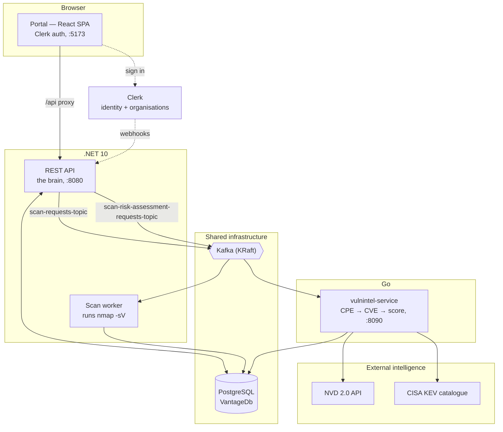
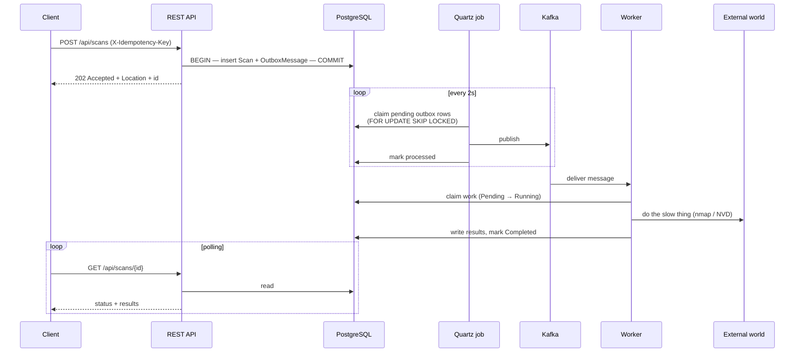
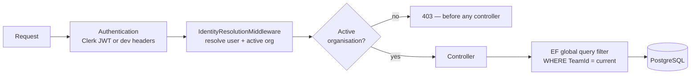

# Vantage — High-Level Architecture

> A commanding view of your attack surface and its risk.

This document explains **what Vantage is, how it is shaped, and why**. It stays
at the level of services, boundaries and flows. For classes, tables and
algorithms see `02-LOW-LEVEL-ARCHITECTURE.md`; for the feature catalogue see
`03-FUNCTIONALITIES.md`; for the rationale behind each pattern and library see
`04-PATTERNS-AND-TECHNOLOGIES.md`.

---

## 1. Problem domain

Security teams need to answer two different questions about their
infrastructure:

1. **What is exposed?** Which hosts are reachable, which ports are open, and
   what software is listening on them.
2. **How dangerous is it?** Which of those services carry known vulnerabilities,
   how severe are they, and which are being actively exploited in the wild.

These two questions have fundamentally different operational characteristics:

| | Discovery (scanning) | Assessment (risk) |
|---|---|---|
| Bound by | Network I/O and remote host latency | CPU, data volume, third-party API quotas |
| Duration | Seconds to many minutes | Sub-second to seconds |
| Failure mode | Timeouts, filtered ports, unreachable hosts | Upstream feed unavailable or throttled |
| Depends on | `nmap`, network egress | NVD, CISA KEV, local CVE cache |
| Changes when | The network changes | The vulnerability corpus changes |

Coupling them into one synchronous process means the slowest, least reliable
part dictates the behaviour of the whole. A scan that takes ten minutes should
not hold an HTTP connection open; a vulnerability feed outage should not prevent
scanning; and re-assessing a host against newly published CVEs should not
require re-scanning it.

**The design goal is therefore to decouple discovery from correlation** into
independently deployable, independently failing, independently scalable
services — while keeping every customer's data strictly isolated.

This is the project's central thesis: *decoupling scanning from vulnerability
correlation as independent, event-driven services.*

---

## 2. System shape

### The four services

| Service | Language | Responsibility |
|---|---|---|
| **REST API** (`Vantage.WebAPI`) | .NET 10 | Accepts requests, owns lifecycle state, enforces auth and tenancy, publishes work. Never performs slow work itself. |
| **Scan worker** (`Vantage.Worker`) | .NET 10 | Consumes scan requests, executes `nmap -sV`, parses XML, writes results. |
| **vulnintel-service** | Go | Consumes assessment requests, resolves CPEs, looks up CVEs, scores findings, writes them back. |
| **Portal** (`src/portal`) | React + Vite | The operator interface. Polls for state; holds no business logic. |

Supporting infrastructure: **PostgreSQL** (single shared database), **Kafka** in
KRaft mode (single broker), **Kafka UI** for inspection, and **Clerk** as the
external identity provider. Everything is orchestrated by one
`docker compose up`.

---

## 3. The core data flow

Both long-running operations follow the **identical** shape. This symmetry is
deliberate: the risk-assessment pipeline is a one-for-one structural clone of
the scan pipeline, which is what demonstrates that the decoupling is a genuine
architectural property rather than a special case.

Five properties fall out of this shape:

1. **The API is always fast.** It performs one local transaction and returns
   `202 Accepted`. It never waits on `nmap` or NVD.
2. **No state can be lost between the database and the broker.** The business
   row and the intent to publish are written in the *same* transaction
   (transactional outbox), so there is no window where one exists without the
   other.
3. **Workers can die at any point.** Unacknowledged messages are redelivered;
   work is claimed atomically so a redelivery cannot double-process.
4. **Workers scale horizontally.** Kafka consumer groups distribute partitions
   across replicas with no coordination code.
5. **Clients never hold a connection.** Progress is observed by polling, which
   requires no callback infrastructure, no websockets, and survives page
   reloads.

---

## 4. Service boundaries

### 4.1 Why polyglot

The vulnerability-intelligence service is written in **Go** while the rest of
the backend is **.NET**. This is a deliberate architectural forcing function.

If two services share a language, it is easy for a boundary to quietly rot: a
shared helper here, a leaked domain type there, and eventually the "services"
are one deployable pretending to be two. Making one service a different runtime
makes that impossible. The Go service **cannot** import a C# class. The only
things crossing the boundary are:

- a **Kafka message contract** (plain JSON), and
- a **database table shape**.

If either contract were sloppy, the split would break immediately and visibly.
Go was chosen specifically because it suits a lean, concurrent, network- and
data-oriented service with a small memory footprint and fast start-up.

### 4.2 Why a shared database

Vantage uses **one PostgreSQL database with one EF Core `AppDbContext`**, rather
than database-per-service. This is the most significant trade-off in the system
and it was made consciously.

**What it buys:**
- **Read-your-writes consistency.** The poll-based UX depends on a completed
  write being immediately visible to the next read. With separate stores this
  becomes eventually consistent and the UI must handle "finished but not yet
  visible".
- **Structural symmetry.** The Go assessment worker writes its results exactly
  the way the .NET scan worker writes its results. One mental model.
- **No result-return channel.** Database-per-service would require a second
  topic, a second consumer in the API, and reconciliation logic — considerable
  machinery for a system whose workers only ever write their own rows.

**What it costs:**
- The Go service is coupled to a schema owned and migrated by EF Core. A
  breaking migration must be coordinated across two codebases.
- Table-level isolation is by convention, not enforced by separate credentials.

**Why the boundary is still real:** the services share *no code and no runtime*.
The coupling is a published schema plus a JSON contract — the same coupling any
two services have to their message formats. The honest characterisation is
"shared-database microservices", and the cost is stated rather than argued away.

### 4.3 Choreography, not orchestration

There is **no central coordinator**. The API emits an event and forgets. Each
worker reacts to events it cares about and writes its own results.

This is choreography. It was chosen because the workflow is genuinely simple —
two independent, single-step reactions with no cross-service compensation, no
ordering requirement between them, and no distributed transaction. Introducing
an orchestrator (saga coordinator, workflow engine) would add a component that
must itself be deployed, monitored and made highly available, in exchange for
coordination this system does not need.

If the workflow later grows steps that must be sequenced or compensated, that is
the point at which orchestration earns its cost.

---

## 5. Security and multi-tenancy

Tenancy is the property most likely to be got wrong through a single forgotten
`WHERE` clause, so it is enforced **structurally** rather than by discipline.

The layers, outermost first:

1. **Authentication.** `Auth:Mode` selects either real **Clerk JWT validation**
   (signature, issuer, expiry, optional audience) or a Development-only
   dev-header handler. The dev handler refuses to start outside Development.
2. **Identity resolution.** A middleware turns token claims into local
   `User` / `Team` / `TeamMembership` rows, just in time.
3. **The no-active-organisation gate.** An authenticated request with no active
   organisation is rejected with **403 before reaching any controller**. This is
   essential: the tenant filter's null-bypass exists for background workers, so
   letting a null-tenant web request through would silently bypass isolation.
4. **The global query filter.** Every query against `Scan` and
   `ScanRiskAssessment` is automatically scoped to the current team by EF Core.
   There are **no per-handler tenant checks** anywhere in the codebase — the
   isolation is a property of the data-access layer, which cannot be forgotten
   when someone adds a new endpoint.
5. **Attribution.** Every scan and assessment records who created it.

The tenant is the **Clerk Organization**. The local `Team` table mirrors it. The
roster is kept in step by two complementary mechanisms — just-in-time sync from
the caller's token, and Clerk webhooks for everyone else (see §6).

---

## 6. Identity synchronisation

Two mechanisms, because neither is sufficient alone:

| Mechanism | Covers | Cannot cover |
|---|---|---|
| **JIT sync** (on each request) | The calling user, their org, their role — always current, no delivery risk | Anyone who has never called the API; removals |
| **Webhooks** (`/api/webhooks/clerk`) | Users, orgs and memberships changing anywhere in Clerk, including invitations and removals | Anything, if delivery fails — it is eventually consistent |

Together they give a roster that is both immediately correct for the caller and
eventually complete for everyone else. Webhook deliveries are verified as Svix
signatures (HMAC-SHA256 with a replay window) before any handler runs.

---

## 7. Resilience

The system is built to degrade rather than fail:

- **External feed failure is contained.** If NVD is unreachable, the CVE lookup
  logs and returns what it has; the assessment still completes with whatever
  signal is available rather than failing outright.
- **Upstream throttling is respected.** The NVD client self-limits to the
  published quota and retries throttling and server faults with exponential
  backoff plus jitter, honouring `Retry-After`.
- **Slow scans cannot hang a worker.** `nmap` is bounded by its own
  `--host-timeout` (graceful, partial results, `Completed`), with a longer
  process-kill backstop (hard, `Failed`) that only fires if nmap itself hangs.
- **Liveness is provable, not assumed.** Each worker upserts a heartbeat row
  every 10 seconds; `GET /api/health` reports a service up only if its heartbeat
  is recent. Because the heartbeat is a database write, a green light proves the
  worker is *both* running *and* able to reach the database.
- **At-least-once delivery with idempotent effects.** Outbox rows are retried
  until published; duplicate creates collapse via an idempotency key; work is
  claimed atomically so redelivery cannot double-process.

---

## 8. Deployment topology

One `docker compose up` brings up eight containers:

| Container | Port | Notes |
|---|---|---|
| `vantage_db` | 5432 | PostgreSQL; migrations applied by the API on start |
| `vantage_kafka` | 9094 | KRaft mode, no ZooKeeper |
| `vantage_kafka_init` | — | Creates topics, then exits |
| `kafka-ui` | 8081 | Broker/topic inspection |
| `vantage_api` | 8080 | REST API + Swagger |
| `vantage_worker` | — | Scan worker; no inbound ports |
| `vulnintel_service` | 8090 | Go service; health endpoint |
| `vantage_portal` | 5173 | Vite dev server |

Kubernetes is explicitly out of scope for this project.

---

## 9. Scaling characteristics

**Compute scales near-linearly.** Both workers are stateless competing
consumers. Adding replicas adds throughput up to the partition count of the
topic, with rebalancing handled by Kafka. The API is likewise stateless and
horizontally scalable behind a load balancer.

**The data layer is the real ceiling.** A single PostgreSQL instance serves
every read and write; a single Kafka broker carries every message. This is the
honest limit — and it is an *availability* ceiling before it is a throughput
one. Neither component is replicated, so either is a single point of failure.
Raising it means standard, well-understood work — read replicas, connection
pooling, partitioned topics, a multi-broker cluster — but that work has not been
done here.

**The external quota is a practical ceiling on new services.** A first-ever
assessment of an unseen product requires an NVD call, rate-limited to roughly
one request per 6.5 seconds without an API key. The cache absorbs everything
after that, so this bites on cold data, not steady state.

---

## 10. What is deliberately not built

Documented as known limitations rather than hidden:

- **Full NVD mirror.** CVE data is fetched on demand and cached with a 7-day
  TTL, not synchronised wholesale. First contact with a new product pays a
  network call.
- **Risk-trend history.** Per-target risk score over time has no UI; the data
  exists in assessment rows.
- **Distro-patch awareness.** A backported fix (for example Ubuntu's patched
  Apache) is not distinguishable from an unpatched upstream version by banner
  alone, so naive version matching can over-report. This is surfaced as a
  *confidence* value rather than silently ignored.
- **Kubernetes.** Out of scope.

---

## 11. Reading order

| Document | Answers |
|---|---|
| `01-HIGH-LEVEL-ARCHITECTURE.md` | What is it, how is it shaped, why |
| `02-LOW-LEVEL-ARCHITECTURE.md` | How is it built — projects, layers, classes, schema |
| `03-FUNCTIONALITIES.md` | What can it do — every feature and endpoint |
| `04-PATTERNS-AND-TECHNOLOGIES.md` | Every pattern and technology, and why each was chosen |
