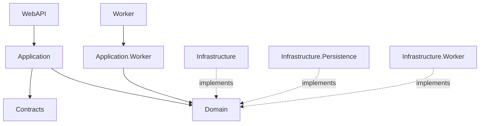
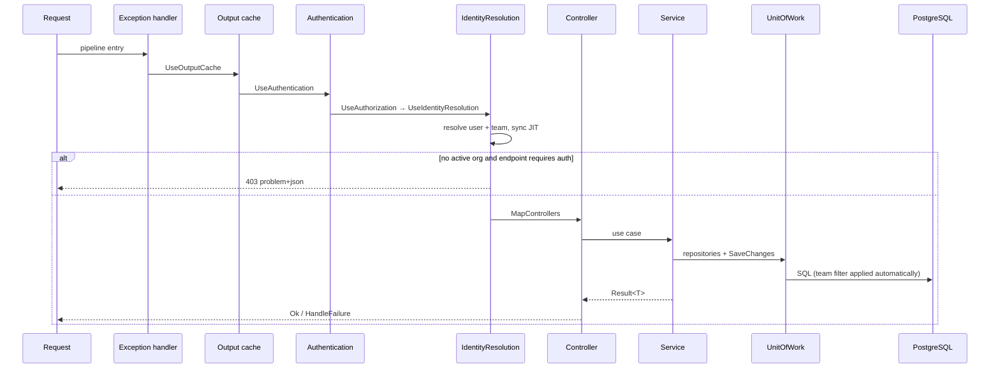
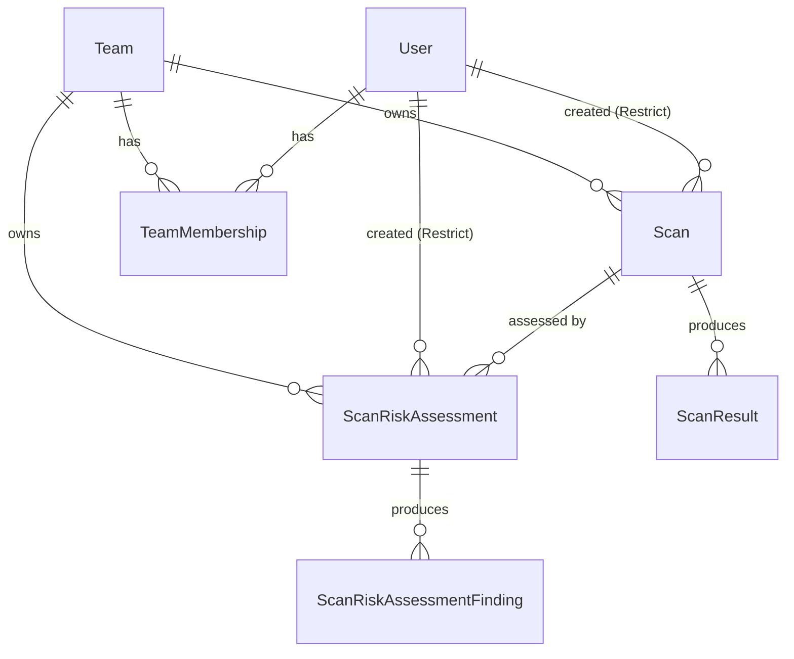
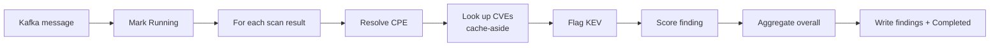

# Vantage — Low-Level Architecture

The implementation in detail: project layout, layer responsibilities, the
classes that matter, the database schema, message contracts, and the concurrency
mechanics that make the whole thing safe.

---

## 1. Repository layout

```
Vantage.sln
compose.yaml                      one-command orchestration
.env                              all container configuration

src/scans/                        the .NET side (API + scan worker)
  Vantage.Domain/                 entities, abstractions, Result types
  Vantage.Contracts/              DTOs and message contracts
  Vantage.Application/            API use cases
  Vantage.Application.Worker/     worker use cases (nmap runner/parser)
  Vantage.Infrastructure/         Kafka producers, Quartz jobs, outbox
  Vantage.Infrastructure.Persistence/  EF Core, repositories, migrations
  Vantage.Infrastructure.Worker/  MassTransit consumer, heartbeat
  Vantage.WebAPI/                 controllers, middleware, security, options
  Vantage.Worker/                 worker host

src/vulnerabilities/vulnintel-service/    the Go side
  cmd/vulnintel/                  service entry point
  cmd/cpe-eval/                   CPE evaluation CLI
  internal/domain/                entities + ports (interfaces)
  internal/application/           the orchestrating service
  internal/cpe/                   CPE resolver (+ eval harness)
  internal/cve/                   cache-aside CVE lookup
  internal/nvd/                   NVD API client
  internal/kev/                   CISA KEV catalogue
  internal/scoring/               risk scoring
  internal/repository/postgres/   pgx adapters
  internal/delivery/kafka/        consumer
  internal/delivery/http/         health endpoint
  internal/config/                environment configuration

src/portal/                       React SPA
tst/                              .NET test projects
docs/                             this documentation
```

---

## 2. The .NET side

### 2.1 Layers and the dependency rule

Clean Architecture with dependencies pointing **inward only**:



| Project | Contains | Depends on |
|---|---|---|
| `Vantage.Domain` | Entities, repository/UoW **interfaces**, `Result`/`Result<T>`, error types | nothing |
| `Vantage.Contracts` | Request/response DTOs, Kafka message contracts, `Status` constants | nothing |
| `Vantage.Application` | `ScansService`, `ScansDiffService`, `ScanRiskAssessmentsService`, `IdentitySyncService`, `ClerkWebhookService`, `DashboardService`, validators, mappers | Domain, Contracts |
| `Vantage.Application.Worker` | `NmapScanRunner`, `NmapScanParser`, worker `ScansService` | Domain, Contracts |
| `Vantage.Infrastructure` | Kafka producers, `IOutboxMessagePublisher` implementations, `ProcessOutboxMessagesJob` | Domain, Contracts |
| `Vantage.Infrastructure.Persistence` | `AppDbContext`, entity configurations, repositories, `UnitOfWork`, migrations | Domain |
| `Vantage.Infrastructure.Worker` | MassTransit `ScanRequestConsumer`, `HeartbeatBackgroundService` | Domain, Contracts |
| `Vantage.WebAPI` | Controllers, middleware, security, options, caching policies | Application, Infrastructure* |
| `Vantage.Worker` | Worker host wiring | Application.Worker, Infrastructure* |

The critical property: **`Domain` and `Application` reference no framework.**
Swapping Postgres, Kafka or nmap touches only an adapter project.

### 2.2 Request lifecycle



Middleware order is load-bearing. `UseIdentityResolution` must run **after**
authentication (it needs claims) and **before** controllers (its 403 must
pre-empt any handler that would otherwise query with a null tenant).

### 2.3 Key classes

**`ApiControllerBase`** — `[ApiController]`, `[Route("api/[controller]")]`, and
`HandleFailure(Result)` which maps the `Result` error model to HTTP:
validation failure → 400 with `ProblemDetails` including inner errors, not found
→ 404, otherwise 400.

**`IdentityResolutionMiddleware`** — the tenancy gate. Reads `sub` (or
`NameIdentifier`), email and name, then resolves the active organisation from
**either** shape:

- flat `org_id` / `org_role` (dev headers, legacy tokens), or
- Clerk's **v2 session token**, which nests organisation data under an `o`
  claim: `{"id": "org_…", "rol": "admin", "slg": "…"}`.

An `org:` role prefix is stripped. The resolved identity is pushed into
`CurrentUserAccessor` / `CurrentTeamAccessor` (scoped services) which the EF
query filter reads.

**`DevSubjectAuthenticationHandler`** — Development-only. Trusts `X-Dev-Subject`,
`X-Dev-Org`, `X-Dev-Role`, `X-Dev-Email`. Selected by `Auth:Mode=DevHeaders`;
the application **refuses to start** if that mode is requested outside
Development.

**`SvixSignatureVerifier`** — static, pure, fully unit-tested. Verifies
`HMAC-SHA256({svix-id}.{svix-timestamp}.{raw body})` against the base64-decoded
signing secret, compares with `CryptographicOperations.FixedTimeEquals`, accepts
any matching `v1,` entry in a space-separated header, and enforces a ±5-minute
timestamp window to defeat replay.

**`UnitOfWork`** — owns the repositories, `SaveChangesAsync`, transaction
control, `IsUniqueConstraintViolation(Exception)` (Postgres `23505` detection)
and `Detach(object)`.

> `Detach` exists for a specific and subtle reason. When `SaveChangesAsync`
> throws on a unique violation, the failed entity remains tracked in `Added`
> state. Any *later* `SaveChangesAsync` in the same request retries that doomed
> insert and throws again — this time outside the catch block. Detaching the
> entity before recovering is what makes the race handling actually correct.

### 2.4 Repository model

```
IReadOnlyRepository<TEntity,TKey>
  GetAllAsync, GetByExpressionAsync, GetByIdAsync,
  FirstOrDefaultAsync, ExistsAsync, CountAsync
        ▲
IRepository<TEntity,TKey>
  CreateAsync, UpdateAsync, DeleteAsync, AddRangeAsync
        ▲
IScanRepository / IScanRiskAssessmentRepository / IOutboxMessageRepository
  domain-specific queries
```

Specialised methods worth knowing:

| Method | Purpose |
|---|---|
| `IScanRepository.ClaimScanAsync` | `ExecuteUpdate` flipping `Pending → Running`; returns whether *this* caller won |
| `IScanRepository.GetCreatedAtInRangeAsync` | Timestamps for the activity chart |
| `IScanRiskAssessmentRepository.GetLatestByScanAsync` | Newest assessment for a scan |
| `IScanRiskAssessmentRepository.GetAverageOverallRiskScoreAsync` | SQL-side average for the dashboard |
| `IOutboxMessageRepository` | Atomic batch claim via `FOR UPDATE SKIP LOCKED` |

---

## 3. Data model



| Table | Key columns | Notes |
|---|---|---|
| `Scans` | `Id`, `RequestId*`, `TeamId`, `CreatedByUserId`, `Target`, `Status`, `CreatedAt`, `CompletedAt`, `ErrorMessage` | `RequestId` unique → idempotency |
| `ScanResults` | `ScanId`, `Port`, `Protocol`, `Service`, `State`, `Product`, `Version` | one row per open port |
| `ScanRiskAssessments` | `Id`, `RequestId*`, `TeamId`, `CreatedByUserId`, `ScanId`, `Status`, `OverallRiskScore`, `RequestedAt`, `CompletedAt` | mirrors `Scans` |
| `ScanRiskAssessmentFindings` | port, service, product, version, `Cpe`, `MatchedCves`, `CvssScore`, `KevFlag`, `MatchConfidence` | one row per assessed service |
| `CveCacheEntries` | (`CpeUri`,`CveId`) PK, `CvssScore`, `CachedAt` | local CVE cache, 7-day TTL |
| `Teams` | `Id`, `ClerkOrgId*`, `Name` | the tenant; mirrors a Clerk Organization |
| `Users` | `Id`, `ClerkUserId*`, `Email`, `Name` | mirrors a Clerk user |
| `TeamMemberships` | `UserId`, `TeamId`, `Role` | cascade-deletes with either side |
| `OutboxMessages` | `Id`, `Type`, `Content`, `Status`, timestamps | the transactional outbox |
| `ServiceHeartbeats` | `ServiceName` PK, `LastSeenAt` | liveness |

`*` = unique index.

**Delete behaviour matters.** `Scan.TeamId` and `ScanRiskAssessment.TeamId`
cascade — deleting a team removes its data. `CreatedByUserId` is **Restrict** —
a user who authored scans cannot be deleted. This is why the `user.deleted`
webhook revokes memberships rather than deleting the user: authorship history
must outlive a membership change.

**Status values** live in `Contracts.Constants.Status`
(`Pending`/`Running`/`Completed`/`Failed`) and are used verbatim by the Go
service — one of the two contracts crossing the language boundary.

EF Core **code-first migrations** are the single schema authority; the API
applies them on start-up.

---

## 4. Asynchronous machinery

### 4.1 Transactional outbox

The dual-write problem: writing a business row to Postgres *and* publishing to
Kafka are two systems. If one succeeds and the other fails, state diverges.

The solution writes both to the *same* database in one transaction:

```
BEGIN
  INSERT INTO Scans …
  INSERT INTO OutboxMessages (Type, Content, Status='Pending') …
COMMIT
```

A **Quartz.NET job runs every 2 seconds** and:

1. Atomically claims a batch of pending rows:
   ```sql
   UPDATE "OutboxMessages" SET "Status" = 'Processing'
   WHERE "Id" IN (
     SELECT "Id" FROM "OutboxMessages"
     WHERE "Status" = 'Pending'
     ORDER BY "OccurredOnUtc"
     FOR UPDATE SKIP LOCKED
     LIMIT @batch
   )
   RETURNING *;
   ```
   `SKIP LOCKED` is the crux: concurrent job runs skip rows another run has
   locked instead of blocking, so the publisher scales without coordination.
2. Dispatches each row **by type** to an `IOutboxMessagePublisher` (Strategy).
3. Marks the row processed, or leaves it pending to be retried.

This yields **at-least-once** delivery, which is why every consumer is
idempotent.

### 4.2 Dispatch by type

`OutboxMessage.Type` selects the publisher:

| Type | Publisher | Transport |
|---|---|---|
| `ScanRequestMessage` | `ScanRequestMessagePublisher` | MassTransit → `scan-requests-topic` |
| `ScanRiskAssessmentRequestedMessage` | `ScanRiskAssessmentRequestedMessagePublisher` | raw `Confluent.Kafka` → `scan-risk-assessment-requests-topic` |

**Why two transports.** MassTransit wraps payloads in its own envelope. The Go
consumer reads plain JSON and cannot parse that envelope, so the risk-assessment
topic bypasses MassTransit and uses the raw producer with explicit camelCase
serialisation. This is a real interoperability constraint, discovered by reading
MassTransit's source, and it is precisely the kind of honesty a polyglot
boundary forces.

### 4.3 Atomic claim

Redelivery is expected, so both workers claim work atomically before doing it:

```csharp
var rowsAffected = await _dbSet
    .Where(s => s.Id == id && s.Status == Status.Pending)
    .ExecuteUpdateAsync(s => s.SetProperty(x => x.Status, Status.Running), ct);

return rowsAffected > 0;   // only the winner proceeds
```

A duplicate delivery finds the row already `Running` and stops.

### 4.4 Backpressure

The scan consumer bounds concurrency explicitly: `PrefetchCount` (twice the
message limit), `ConcurrentMessageLimit`, `ConcurrentConsumerLimit`, and a
5-second checkpoint interval. A burst of scan requests therefore cannot pull
unbounded work into one worker.

---

## 5. The scan worker

`nmap` is invoked with a fixed, bounded argument list:

```
nmap -Pn -sV -T4 --max-retries 1 --host-timeout 600s -oX - <target>
```

| Flag | Why |
|---|---|
| `-Pn` | Skip host discovery; treat the host as up |
| `-sV` | Service/version detection — **required**, since a CPE needs product + version |
| `-T4` | Faster timing template |
| `--max-retries 1` | Stop re-probing dropped ports |
| `--host-timeout 600s` | nmap self-limits, exits 0 with partial results |
| `-oX -` | XML to stdout for parsing |

**Two timeouts, deliberately different:**

| Timeout | Mechanism | Outcome |
|---|---|---|
| `--host-timeout 600s` | nmap gives up gracefully, exit 0, partial XML | scan → **Completed** |
| `Nmap:TimeoutSeconds` (660s) | hard `Process.Kill(entireProcessTree)` | scan → **Failed** |

The gap is intentional. The graceful budget must fire *first* so partial results
survive; the process kill is a backstop for nmap itself hanging. Setting them
equal would race, and the kill could destroy results nmap was about to emit.

Failure classification relies on **exit code and empty output**, not on stderr
being non-empty — nmap writes non-fatal warnings (including its own host-timeout
notice) to stderr, and treating those as errors would defeat the graceful path.

Results are parsed from XML into `ScanResult` rows (port, protocol, service,
state, product, version).

---

## 6. The Go service

### 6.1 Ports and adapters

`internal/domain` defines entities **and interfaces** (ports); everything else
implements them. Compile-time assertions (`var _ domain.Scorer = (*Scorer)(nil)`)
enforce conformance.

| Port | Adapter |
|---|---|
| `StatusWriter`, `FindingsWriter` | `repository/postgres` (pgx) |
| `CPEResolver` | `cpe` |
| `CVELookup` | `cve` (cache-aside over `nvd`) |
| `KEVCatalog` | `kev` |
| `Scorer` | `scoring` |
| `ScanRiskAssessmentService` | `application` |

`cmd/vulnintel/main.go` wires concrete adapters into the application service —
the only place that knows every concrete type.

### 6.2 The assessment pipeline



### 6.3 CPE resolution

The **anti-corruption layer** between messy banners and canonical identifiers.

```go
Resolve(product, version) → { URI, Confidence }
```

1. Lower-case and trim the product; look it up in a curated
   `vendor:product` dictionary (`openssh → openbsd:openssh`,
   `apache httpd → apache:http_server`, `mysql → oracle:mysql`, …). The
   dictionary exists because **the vendor is frequently not the product name** —
   getting this wrong means CVE lookups silently return nothing.
2. Normalise the version with `[0-9]+(\.[0-9]+)*([a-z][0-9a-z]*)?`, which turns
   `6.6.1p1 Ubuntu 2ubuntu2.13` into `6.6.1p1` and `8.3.0 - 8.3.7` into `8.3.0`.
3. Emit `cpe:2.3:a:{vendor}:{product}:{version}:*:*:*:*:*:*:*`.
4. If the product is unknown, fall back to using its first token as both vendor
   and product — and say so through a **low confidence**.

Confidence is the honesty mechanism:

| Case | Confidence |
|---|---|
| Dictionary hit + version | 0.9 |
| Dictionary hit, no version | 0.6 |
| Fallback + version | 0.4 |
| Fallback, no version | 0.2 |

### 6.4 CVE lookup (cache-aside)

1. Read `CveCacheEntries` for the CPE. Fresh (< 7 days) → return, no network.
2. Miss → call NVD, then populate the cache.
3. NVD unreachable → log, return what is available; the assessment still
   completes.

The NVD client self-throttles with a monotonic next-slot clock (≈1 request per
6.5 s anonymously, ≈1 per 0.7 s with `NVD_API_KEY`) so concurrent assessments
queue rather than burst. Failures retry up to four times with exponential
backoff plus jitter, honouring `Retry-After`. Only 429/403/5xx and transport
errors retry; a 4xx fails immediately rather than burning quota. Every wait is
context-aware.

CVSS is taken from v3.1, falling back to v3.0, then v2.

### 6.5 Scoring

```go
finding_score = min(base × kev_multiplier, 10)
```

- `base` = the CVE's CVSS score; if there are **no** CVEs, a heuristic by
  service: telnet 7.0, rdp/vnc 6.0, ftp 5.0, smb 5.0, otherwise 0.0. This exists
  so a dangerous-but-unversioned service is not scored as harmless.
- `kev_multiplier` = 1.15 when the CVE appears in the CISA KEV catalogue —
  known-exploited vulnerabilities deserve more weight than severity alone.

```go
overall = min(0.7 × worst + 0.3 × average, 10)
```

The 70/30 weighting is a judgement: one critical exposure should dominate the
headline number, but breadth should still move it. A pure maximum would ignore
how many services are affected; a pure mean would let a hundred benign services
bury one critical one.

---

## 7. The portal

**Stack:** Vite 5, React 18, TypeScript, Tailwind v3, shadcn/ui, TanStack Query,
react-router-dom, recharts, sonner, `@clerk/react` (Core 3). Requires Node ≥
20.9.

```
src/api/       client.ts (fetch + error extraction), auth-headers.ts,
               scans.ts, riskAssessments.ts, diff.ts, dashboard.ts,
               activity.ts, health.ts, types.ts
src/components/ AppShell, AppSidebar, AuthBridge, OrgGate, NewScanDialog,
               RiskAssessmentPanel, SectionCards, ActivityChart, StatusBadge, ui/
src/pages/     DashboardPage, ScansListPage, ScanDetailPage,
               ScanDiffPage, StatusPage
```

**Auth wiring.** `<ClerkProvider>` wraps the app; `<Show when="signed-out">`
redirects to Clerk, `<Show when="signed-in">` renders `AuthBridge`, the org gate
and the router. `AuthBridge` reads the live Clerk session and the API client
attaches on every request: `Authorization: Bearer <jwt>`, the `X-Dev-*` headers
for dev mode, and a fresh `X-Idempotency-Key` on creates.

> Core 3 renamed things: `<SignedIn>`/`<SignedOut>` became
> `<Show when="signed-in|signed-out">`, and the appearance variables changed
> (`colorText → colorForeground`, `colorInputBackground → colorInput`, …).
> Using the old names silently produces an unthemed widget.

**Server state** is entirely TanStack Query. Polling intervals adapt: the scans
list polls faster while any scan is `Pending`/`Running`; detail and assessment
panels stop polling once terminal. Switching organisation clears the cache so no
other tenant's data can survive the switch.

**Error surfacing.** `extractError` prefers the API's specific validation
messages (an array of `{code, message}`) over the generic `detail` field, so the
toast reads *"Target must be a valid IP address or hostname"* rather than
*"ValidationFailure"*.

---

## 8. Configuration

| Variable | Consumer | Meaning |
|---|---|---|
| `DB_CONNECTION_STRING` | API, worker | Postgres (EF Core) |
| `VULNINTEL_DB_CONNECTION_STRING` | Go | Postgres (pgx) |
| `KAFKA_BOOTSTRAP_SERVERS` | all | Broker |
| `KAFKA_SCAN_REQUESTS_TOPIC` | API, worker | Scan topic |
| `KAFKA_SCAN_RISK_ASSESSMENT_REQUESTS_TOPIC` | API, Go | Assessment topic |
| `KAFKA_SCAN_REQUESTS_CONCURRENT_*` | worker | Backpressure limits |
| `NMAP_TIMEOUT_SECONDS` | worker | Hard process-kill backstop (660) |
| `NVD_API_KEY` | Go | Optional; raises the NVD rate limit |
| `ASPNETCORE_ENVIRONMENT` | API | Swagger, HTTPS redirect, dev-auth eligibility |
| `AUTH_MODE` | API | `DevHeaders` or `Clerk`; blank = per environment |
| `CLERK_AUTHORITY` / `CLERK_AUDIENCE` | API | JWT issuer/audience |
| `CLERK_WEBHOOK_SIGNING_SECRET` | API | Svix verification; absent → endpoint returns 503 |
| `VITE_CLERK_PUBLISHABLE_KEY` | portal | Clerk client key |

---

## 9. Testing

| Suite | Location | Covers |
|---|---|---|
| .NET (44) | `tst/` | Services, nmap XML parsing, Svix verification (13), webhook handlers (9) |
| Go | `internal/**/\*_test.go` | CPE resolver, scorer, NVD client (7: retry, replay, rate limiting, cancellation), CPE evaluation |
| Evaluation | `cmd/cpe-eval` | Precision/recall vs a naive baseline over a labelled corpus |
| End-to-end | manual / Playwright | Full stack: auth, scan, assessment, diff, tenancy, webhooks |

The philosophy: **unit-test algorithms and business rules; prove wiring with
real end-to-end runs** rather than mocking Kafka, Postgres and nmap.
